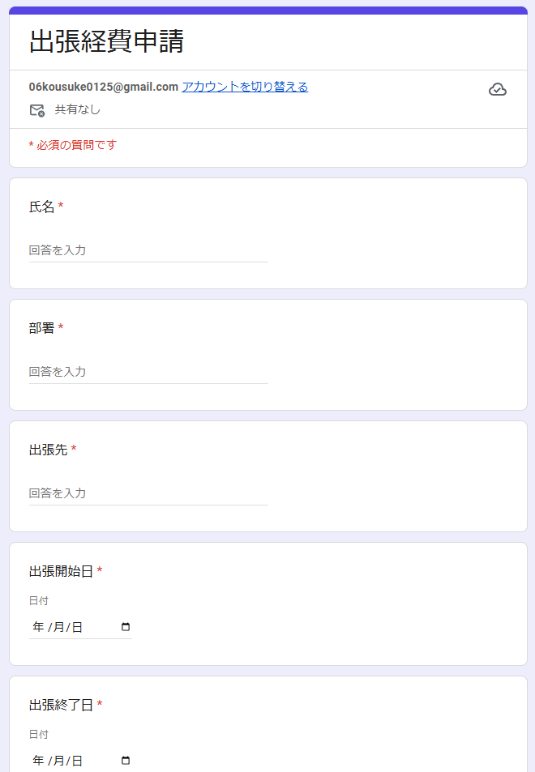
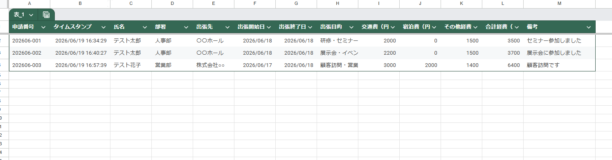
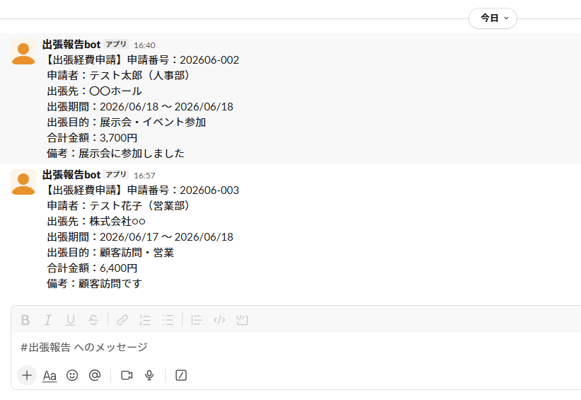

# GAS業務自動化ポートフォリオ③｜Googleフォーム連携・Slack API通知システム

## 概要
Google Apps Script（GAS）とSlack APIを連携させた出張経費申請の自動化システムです。
Googleフォームからの申請をトリガーに、申請履歴への自動追記・合計金額の自動計算・
申請番号の自動採番・Slackチャンネルへの自動通知までを一貫して自動化します。

## できること
- Googleフォームの送信をトリガーに自動で処理を実行
- 交通費・宿泊費・その他経費から合計金額を自動計算
- 年月+連番形式（例：202606-001）で申請番号を自動採番
- 申請履歴シートへの自動追記（テーブル形式でフィルター機能付き）
- Slack APIを使用して指定チャンネルに申請内容を自動通知

## 使用技術
- Google Apps Script
- Google フォーム
- Google スプレッドシート
- Slack API（chat.postMessage）

## 動作イメージ
### ①Googleフォームの入力画面

### ②申請履歴シート（合計金額・申請番号自動追記）

### ③Slackへの自動通知

## セットアップ手順
1. GoogleドライブにGAS用フォルダを作成
2. フォルダ内にGoogleフォームを新規作成し以下の項目を追加
   - 氏名（短文・必須）
   - 部署（短文・必須）
   - 出張先（短文・必須）
   - 出張開始日（日付・必須）
   - 出張終了日（日付・必須）
   - 出張目的（選択肢・必須）
   - 交通費（円）（短文・数値・必須）
   - 宿泊費（円）（短文・数値・必須）
   - その他経費（円）（短文・数値・必須）
   - 備考（短文・任意）
3. フォームの「回答」タブからスプレッドシートと連携
4. スプレッドシートに「申請履歴」シートを作成し1行目にヘッダーを入力
5. Slack APIのセットアップ
   - https://api.slack.com/apps でアプリを作成
   - Bot Token Scopesに`chat:write`を追加
   - ワークスペースにインストールしてBot Tokenを取得
   - 通知先チャンネルにBotを招待
6. スプレッドシートの「拡張機能」→「Apps Script」を開く
7. 「コード.gs」のコードをすべてコピー&ペースト
8. GASのスクリプトプロパティに以下を追加
   - プロパティ名：`SLACK_TOKEN`
   - 値：取得したBot Token
9. コード内の`channelId`を通知先チャンネルのIDに変更
10. トリガーを設定
    - 実行する関数：onFormSubmit
    - イベントのソース：スプレッドシートから
    - イベントの種類：フォーム送信時

## 工夫した点
- Slack APIのトークンをスクリプトプロパティで管理しコードに直書きしない安全な設計
- ヘッダー名で列を動的に検索するため列順が変わっても正常に動作
- 月が変わると採番が自動でリセット（例：202606-001→202607-001）
- `UrlFetchApp`を使用した外部API連携の実装

## 今後追加予定の機能
- 承認・却下ステータスの管理機能
- 月次集計レポートの自動生成
- Slackからの承認・却下操作への対応
